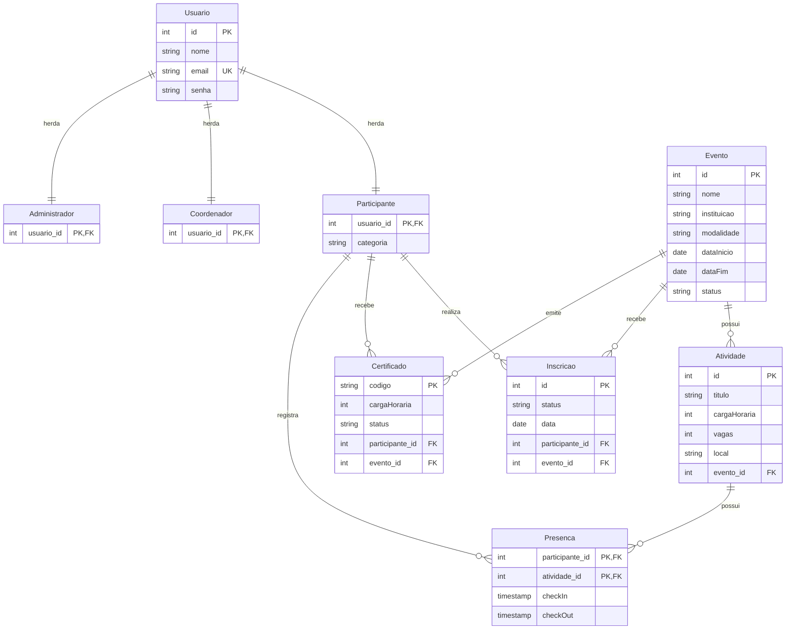
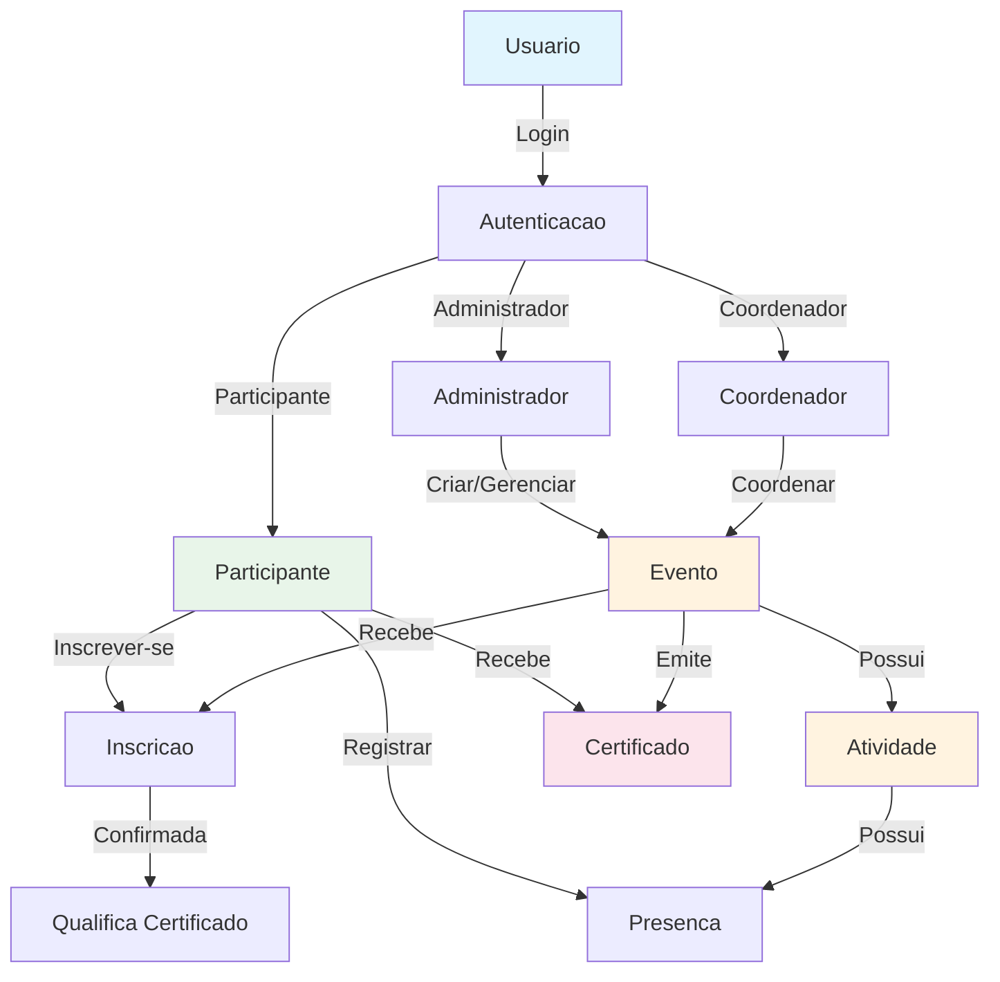
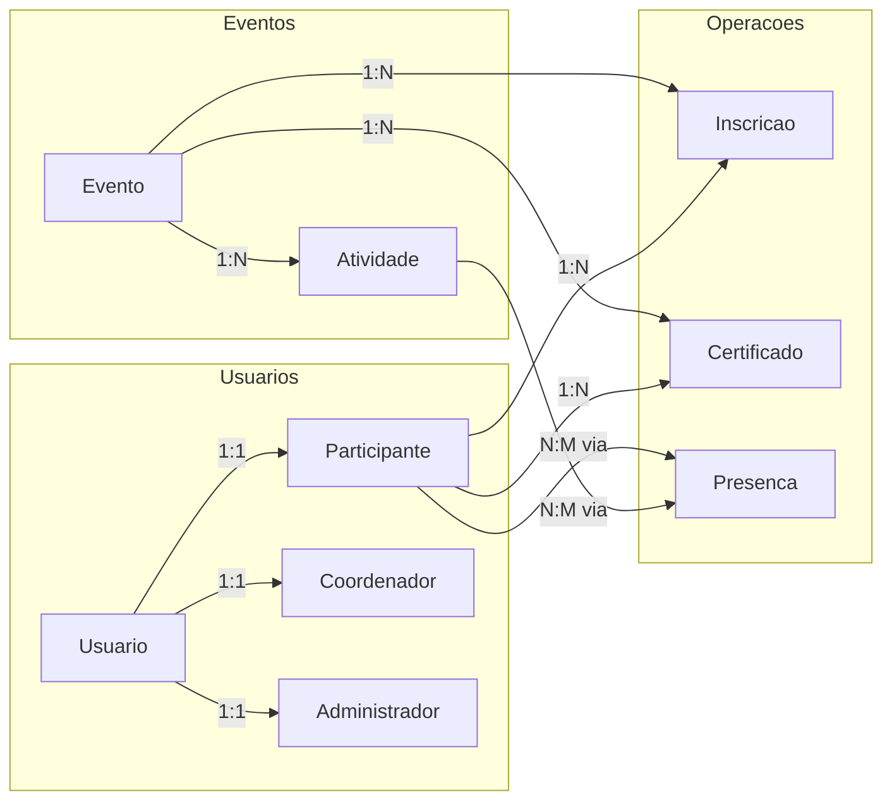

# Relatorio do Banco de Dados - Sistema de Gestao de Eventos Academicos (SGEA)

## 1. Visao Geral

O banco de dados **sistema_eventos** e projetado para gerenciar eventos academicos, incluindo controle de usuarios (participantes, coordenadores e administradores), eventos, atividades, inscricoes, presencas e certificados.

**SGBD:** PostgreSQL  
**Encoding:** UTF8  
**Modelo de heranca:** Tabela pai `Usuario` + tabelas filhas + `VIEW vw_usuario_tipo` para calculo dinamico do tipo

---

## 2. Diagrama Entidade-Relacionamento (ER)



---

## 3. Diagrama de Fluxo de Dados



---

## 4. Descricao das Tabelas

### 4.1 Usuario (Tabela Pai)

Tabela base para o sistema de heranca de usuarios. **Nao possui campo `tipo`** — o tipo e calculado dinamicamente pela view `vw_usuario_tipo` baseada na existencia do registro na tabela filha correspondente.

| Coluna | Tipo | Restricao | Descricao |
|--------|------|-----------|-----------|
| id | SERIAL | PK | Identificador unico (auto-incremento) |
| nome | VARCHAR(255) | NOT NULL | Nome completo do usuario |
| email | VARCHAR(255) | UNIQUE, NOT NULL | Email (identificador unico) |
| senha | VARCHAR(255) | NOT NULL | Senha do usuario |

### 4.2 Participante

Herda de Usuario via chave estrangeira.

| Coluna | Tipo | Restricao | Descricao |
|--------|------|-----------|-----------|
| usuario_id | INT | PK, FK | Referencia ao Usuario (id) |
| categoria | VARCHAR(255) | - | Categoria do participante (ex: aluno, professor, visitante) |

### 4.3 Coordenador

Herda de Usuario via chave estrangeira.

| Coluna | Tipo | Restricao | Descricao |
|--------|------|-----------|-----------|
| usuario_id | INT | PK, FK | Referencia ao Usuario (id) |

### 4.4 Administrador

Herda de Usuario via chave estrangeira.

| Coluna | Tipo | Restricao | Descricao |
|--------|------|-----------|-----------|
| usuario_id | INT | PK, FK | Referencia ao Usuario (id) |

### 4.5 Evento

Tabela principal de eventos academicos.

| Coluna | Tipo | Restricao | Descricao |
|--------|------|-----------|-----------|
| id | SERIAL | PK | Identificador unico |
| nome | VARCHAR(255) | NOT NULL | Nome do evento |
| instituicao | VARCHAR(255) | - | Instituicao organizadora |
| modalidade | VARCHAR(255) | - | Modalidade (presencial, online, hibrido) |
| dataInicio | DATE | - | Data de inicio |
| dataFim | DATE | - | Data de termino |
| status | VARCHAR(50) | - | Status (ativo, pendente, cancelado, finalizado) |

### 4.6 Atividade

Atividades vinculadas a um evento.

| Coluna | Tipo | Restricao | Descricao |
|--------|------|-----------|-----------|
| id | SERIAL | PK | Identificador unico |
| titulo | VARCHAR(255) | NOT NULL | Titulo da atividade |
| cargaHoraria | INT | - | Carga horaria (horas) |
| vagas | INT | - | Numero de vagas disponiveis |
| local | VARCHAR(255) | - | Local da atividade |
| evento_id | INT | FK, NOT NULL | Referencia ao Evento (id) |

### 4.7 Inscricao

Registro de inscricoes de participantes em eventos.

| Coluna | Tipo | Restricao | Descricao |
|--------|------|-----------|-----------|
| id | SERIAL | PK | Identificador unico |
| status | VARCHAR(50) | - | Status (pendente, confirmada, cancelada) |
| data | DATE | DEFAULT CURRENT_DATE | Data da inscricao |
| participante_id | INT | FK, NOT NULL | Referencia ao Participante (usuario_id) |
| evento_id | INT | FK, NOT NULL | Referencia ao Evento (id) |

### 4.8 Certificado

Certificados emitidos para participantes.

| Coluna | Tipo | Restricao | Descricao |
|--------|------|-----------|-----------|
| codigo | VARCHAR(255) | PK | Codigo unico de validacao |
| cargaHoraria | INT | - | Carga horaria certificada |
| status | VARCHAR(50) | - | Status (emitido, pendente, cancelado) |
| participante_id | INT | FK, NOT NULL | Referencia ao Participante (usuario_id) |
| evento_id | INT | FK, NOT NULL | Referencia ao Evento (id) |

### 4.9 Presenca

Controle de presenca em atividades (chave composta).

| Coluna | Tipo | Restricao | Descricao |
|--------|------|-----------|-----------|
| checkIn | TIMESTAMP | - | Horario de entrada |
| checkOut | TIMESTAMP | - | Horario de saida |
| participante_id | INT | PK, FK, NOT NULL | Referencia ao Participante (usuario_id) |
| atividade_id | INT | PK, FK, NOT NULL | Referencia a Atividade (id) |

---

## 5. View: vw_usuario_tipo

O tipo do usuario e calculado dinamicamente por uma VIEW, garantindo que o tipo sempre reflita a realidade dos dados nas tabelas filhas. Isso elimina o risco de inconsistencia entre um campo `tipo` armazenado e os registros reais.

```sql
CREATE VIEW vw_usuario_tipo AS
SELECT 
    u.id,
    u.nome,
    u.email,
    u.senha,
    CASE 
        WHEN p.usuario_id IS NOT NULL THEN 'participante'
        WHEN c.usuario_id IS NOT NULL THEN 'coordenador'
        WHEN a.usuario_id IS NOT NULL THEN 'administrador'
        ELSE 'sem_perfil'
    END AS tipo
FROM Usuario u
LEFT JOIN Participante p ON u.id = p.usuario_id
LEFT JOIN Coordenador c ON u.id = c.usuario_id
LEFT JOIN Administrador a ON u.id = a.usuario_id;
```

| Valor do `tipo` | Condicao |
|---|---|
| `participante` | Existe registro em `Participante` |
| `coordenador` | Existe registro em `Coordenador` |
| `administrador` | Existe registro em `Administrador` |
| `sem_perfil` | Nao existe em nenhuma tabela filha |

---

## 6. Relacionamentos



### Resumo dos Relacionamentos

| Tabela Origem | Tabela Destino | Cardinalidade | Tipo |
|---------------|----------------|---------------|------|
| Usuario | Participante | 1:1 | Heranca |
| Usuario | Coordenador | 1:1 | Heranca |
| Usuario | Administrador | 1:1 | Heranca |
| Evento | Atividade | 1:N | Composicao |
| Evento | Inscricao | 1:N | Associacao |
| Evento | Certificado | 1:N | Associacao |
| Participante | Inscricao | 1:N | Associacao |
| Participante | Certificado | 1:N | Associacao |
| Participante + Atividade | Presenca | N:M | Associacao (tabela associativa) |

---

## 7. Script SQL Completo

```sql
CREATE DATABASE sistema_eventos WITH ENCODING = 'UTF8';

DROP VIEW IF EXISTS vw_usuario_tipo;
DROP TABLE IF EXISTS Presenca;
DROP TABLE IF EXISTS Certificado;
DROP TABLE IF EXISTS Inscricao;
DROP TABLE IF EXISTS Atividade;
DROP TABLE IF EXISTS Evento;
DROP TABLE IF EXISTS Administrador;
DROP TABLE IF EXISTS Coordenador;
DROP TABLE IF EXISTS Participante;
DROP TABLE IF EXISTS Usuario;

CREATE TABLE Usuario (
    id SERIAL PRIMARY KEY,
    nome VARCHAR(255) NOT NULL,
    email VARCHAR(255) UNIQUE NOT NULL,
    senha VARCHAR(255) NOT NULL
);

CREATE TABLE Participante (
    usuario_id INT PRIMARY KEY,
    categoria VARCHAR(255),
    CONSTRAINT fk_participante_usuario FOREIGN KEY (usuario_id)
        REFERENCES Usuario(id) ON DELETE CASCADE
);

CREATE TABLE Coordenador (
    usuario_id INT PRIMARY KEY,
    CONSTRAINT fk_coordenador_usuario FOREIGN KEY (usuario_id)
        REFERENCES Usuario(id) ON DELETE CASCADE
);

CREATE TABLE Administrador (
    usuario_id INT PRIMARY KEY,
    CONSTRAINT fk_administrador_usuario FOREIGN KEY (usuario_id)
        REFERENCES Usuario(id) ON DELETE CASCADE
);

CREATE TABLE Evento (
    id SERIAL PRIMARY KEY,
    nome VARCHAR(255) NOT NULL,
    instituicao VARCHAR(255),
    modalidade VARCHAR(255),
    dataInicio DATE,
    dataFim DATE,
    status VARCHAR(50)
);

CREATE TABLE Atividade (
    id SERIAL PRIMARY KEY,
    titulo VARCHAR(255) NOT NULL,
    cargaHoraria INT,
    vagas INT,
    local VARCHAR(255),
    evento_id INT NOT NULL,
    CONSTRAINT fk_atividade_evento FOREIGN KEY (evento_id)
        REFERENCES Evento(id) ON DELETE CASCADE
);

CREATE TABLE Inscricao (
    id SERIAL PRIMARY KEY,
    status VARCHAR(50),
    data DATE DEFAULT CURRENT_DATE,
    participante_id INT NOT NULL,
    evento_id INT NOT NULL,
    CONSTRAINT fk_inscricao_participante FOREIGN KEY (participante_id)
        REFERENCES Participante(usuario_id) ON DELETE CASCADE,
    CONSTRAINT fk_inscricao_evento FOREIGN KEY (evento_id)
        REFERENCES Evento(id) ON DELETE CASCADE
);

CREATE TABLE Certificado (
    codigo VARCHAR(255) PRIMARY KEY,
    cargaHoraria INT,
    status VARCHAR(50),
    participante_id INT NOT NULL,
    evento_id INT NOT NULL,
    CONSTRAINT fk_certificado_participante FOREIGN KEY (participante_id)
        REFERENCES Participante(usuario_id) ON DELETE CASCADE,
    CONSTRAINT fk_certificado_evento FOREIGN KEY (evento_id)
        REFERENCES Evento(id) ON DELETE CASCADE
);

CREATE TABLE Presenca (
    checkIn TIMESTAMP,
    checkOut TIMESTAMP,
    participante_id INT NOT NULL,
    atividade_id INT NOT NULL,
    PRIMARY KEY (participante_id, atividade_id),
    CONSTRAINT fk_presenca_participante FOREIGN KEY (participante_id)
        REFERENCES Participante(usuario_id) ON DELETE CASCADE,
    CONSTRAINT fk_presenca_atividade FOREIGN KEY (atividade_id)
        REFERENCES Atividade(id) ON DELETE CASCADE
);

CREATE VIEW vw_usuario_tipo AS
SELECT
    u.id, u.nome, u.email, u.senha,
    CASE
        WHEN p.usuario_id IS NOT NULL THEN 'participante'
        WHEN c.usuario_id IS NOT NULL THEN 'coordenador'
        WHEN a.usuario_id IS NOT NULL THEN 'administrador'
        ELSE 'sem_perfil'
    END AS tipo
FROM Usuario u
LEFT JOIN Participante p ON u.id = p.usuario_id
LEFT JOIN Coordenador c ON u.id = c.usuario_id
LEFT JOIN Administrador a ON u.id = a.usuario_id;
```

---

## 8. Regras de Negocio e Restricoes

### 8.1 Integridade Referencial

- **ON DELETE CASCADE** em todas as chaves estrangeiras:
  - Participante, Coordenador, Administrador (se usuario for deletado, o registro especifico tambem e)
  - Atividade (se evento for deletado, atividades tambem sao)
  - Inscricao (se participante ou evento for deletado, inscricao tambem e)
  - Certificado (se participante ou evento for deletado, certificado tambem e)
  - Presenca (se participante ou atividade for deletado, presenca tambem e)

### 8.2 Validacoes

- Email deve ser unico na tabela Usuario
- Codigo do certificado deve ser unico (chave primaria)
- Presenca usa chave composta (participante_id + atividade_id) para evitar duplicidade

### 8.3 Valores Padrao

- Data de inscricao: data atual do sistema (CURRENT_DATE)
- IDs: auto-incremento via SERIAL
- Tipo do usuario: calculado dinamicamente pela VIEW `vw_usuario_tipo`

---

## 9. Indices Recomendados

```sql
CREATE INDEX idx_usuario_email ON Usuario(email);
CREATE INDEX idx_inscricao_participante ON Inscricao(participante_id);
CREATE INDEX idx_inscricao_evento ON Inscricao(evento_id);
CREATE INDEX idx_presenca_atividade ON Presenca(atividade_id);
CREATE INDEX idx_certificado_codigo ON Certificado(codigo);
CREATE INDEX idx_atividade_evento ON Atividade(evento_id);
```

---

## 10. Consultas Uteis (Queries)

### 10.1 Listar todos os usuarios com tipo (via view)

```sql
SELECT id, nome, email, tipo FROM vw_usuario_tipo ORDER BY id;
```

### 10.2 Listar todos os participantes com seus dados

```sql
SELECT u.id, u.nome, u.email, p.categoria
FROM Usuario u
JOIN Participante p ON u.id = p.usuario_id;
```

### 10.3 Eventos com suas atividades

```sql
SELECT e.nome AS evento, a.titulo AS atividade, a.cargaHoraria, a.local
FROM Evento e
LEFT JOIN Atividade a ON e.id = a.evento_id
ORDER BY e.dataInicio, a.titulo;
```

### 10.4 Participantes inscritos em um evento

```sql
SELECT u.nome, u.email, i.status, i.data
FROM Inscricao i
JOIN Participante p ON i.participante_id = p.usuario_id
JOIN Usuario u ON p.usuario_id = u.id
WHERE i.evento_id = ?;
```

### 10.5 Presenca em atividades

```sql
SELECT u.nome, a.titulo, pr.checkIn, pr.checkOut
FROM Presenca pr
JOIN Participante p ON pr.participante_id = p.usuario_id
JOIN Usuario u ON p.usuario_id = u.id
JOIN Atividade a ON pr.atividade_id = a.id
ORDER BY a.titulo, pr.checkIn;
```

### 10.6 Certificados emitidos

```sql
SELECT c.codigo, u.nome AS participante, e.nome AS evento, 
       c.cargaHoraria, c.status
FROM Certificado c
JOIN Participante p ON c.participante_id = p.usuario_id
JOIN Usuario u ON p.usuario_id = u.id
JOIN Evento e ON c.evento_id = e.id;
```

---

## 11. Consideracoes do Modelo

### Pontos Fortes

1. **Heranca via Chave Estrangeira**: Implementa corretamente o padrao de heranca no PostgreSQL
2. **VIEW para tipo**: O tipo e sempre um reflexo dos dados reais, eliminando inconsistencia silenciosa
3. **Integridade Referencial**: Uso adequado de chaves estrangeiras
4. **Cascade Delete**: Tratamento apropriado para entidades dependentes
5. **Chave Composta**: Presenca usa (participante_id, atividade_id) evitando duplicidade

### Possiveis Melhorias

1. Adicionar **CHECK constraints** para validar valores (ex: status, modalidade)
2. Implementar **indices** para melhorar performance em consultas frequentes
3. Adicionar campos de **auditoria** (created_at, updated_at) se necessario
4. Adicionar **unique constraint** em Inscricao (participante_id, evento_id) para evitar inscricoes duplicadas
5. Considerar **hash de senha** (bcrypt/argon2) em vez de armazenamento em texto puro

---

## 12. Diagrama de Classes (Representacao Orientada a Objetos)

```
+-------------------------+
|        Usuario          |
+-------------------------+
| - id: int               |
| - nome: string          |
| - email: string         |
| - senha: string         |
+------------+------------+
             |
     +-------+-------+-----------+
     v               v           v
+-----------+   +-----------+  +---------------+
|Participante|  |Coordenador|  |Administrador  |
+-----------+   +-----------+  +---------------+
|- categoria  |  |           |  |               |
+-----+------+  +-----------+  +---------------+
      |
      |
+-----+---------------------------------------+
|            Sistema de Eventos               |
+---------------------------------------------+
| Evento ----> Atividade                      |
| Participante --> Inscricao --> Evento       |
| Participante --> Presenca --> Atividade     |
| Participante --> Certificado <-- Evento     |
+---------------------------------------------+
```

---

## 13. Glossario

| Termo | Definicao |
|-------|-----------|
| SERIAL | Tipo de dado PostgreSQL para auto-incremento |
| PK | Primary Key (Chave Primaria) |
| FK | Foreign Key (Chave Estrangeira) |
| UK | Unique Key (Chave Unica) |
| CASCADE | Acao referencial que propaga delecao para tabelas dependentes |
| TIMESTAMP | Tipo de dado para data e hora |
| CHECK | Restricao para validar valores em colunas |
| VIEW | Tabela virtual que calcula dados dinamicamente a partir de outras tabelas |

---

**Documento gerado em:** 2026-05-18  
**Versao do Banco:** 2.0 (com VIEW vw_usuario_tipo)  
**Autor:** Sistema SGEA
