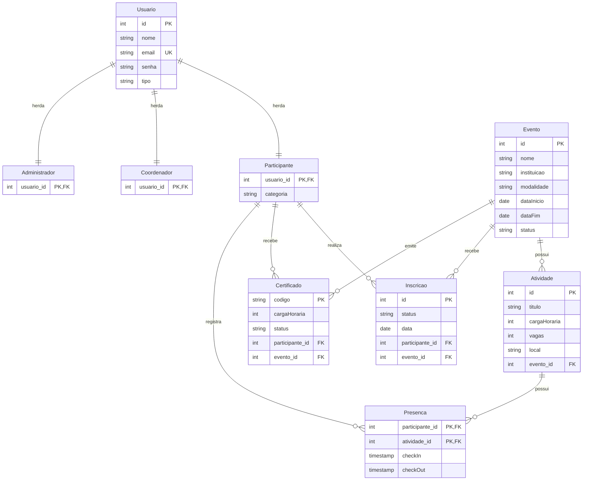
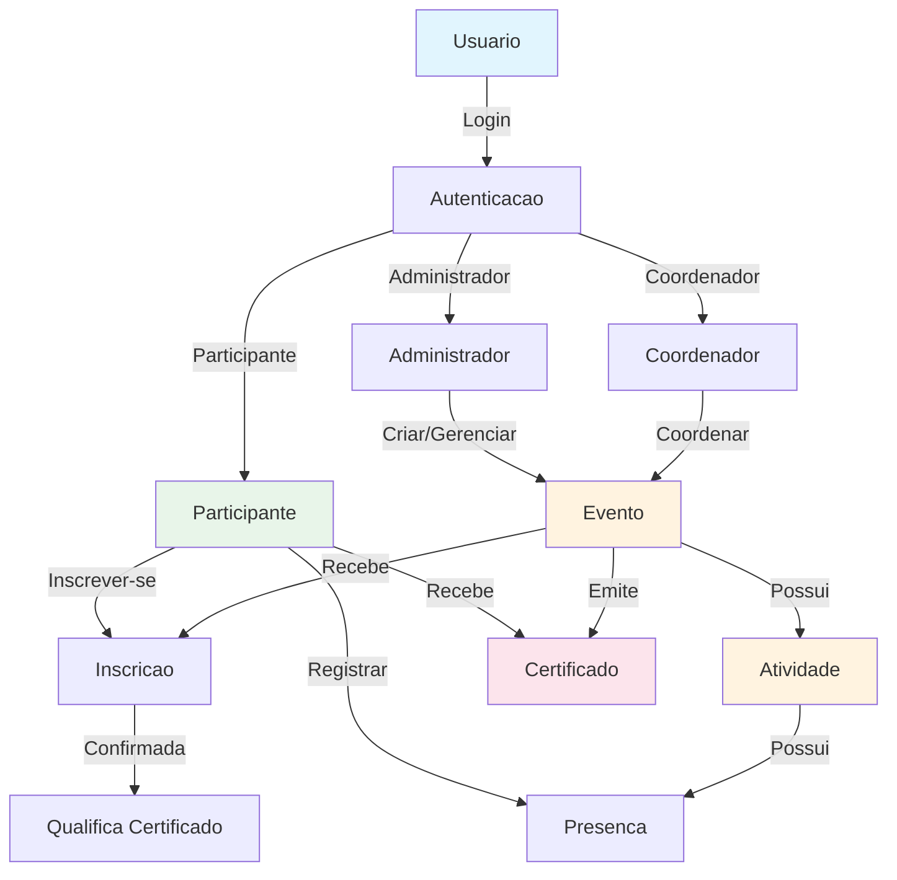
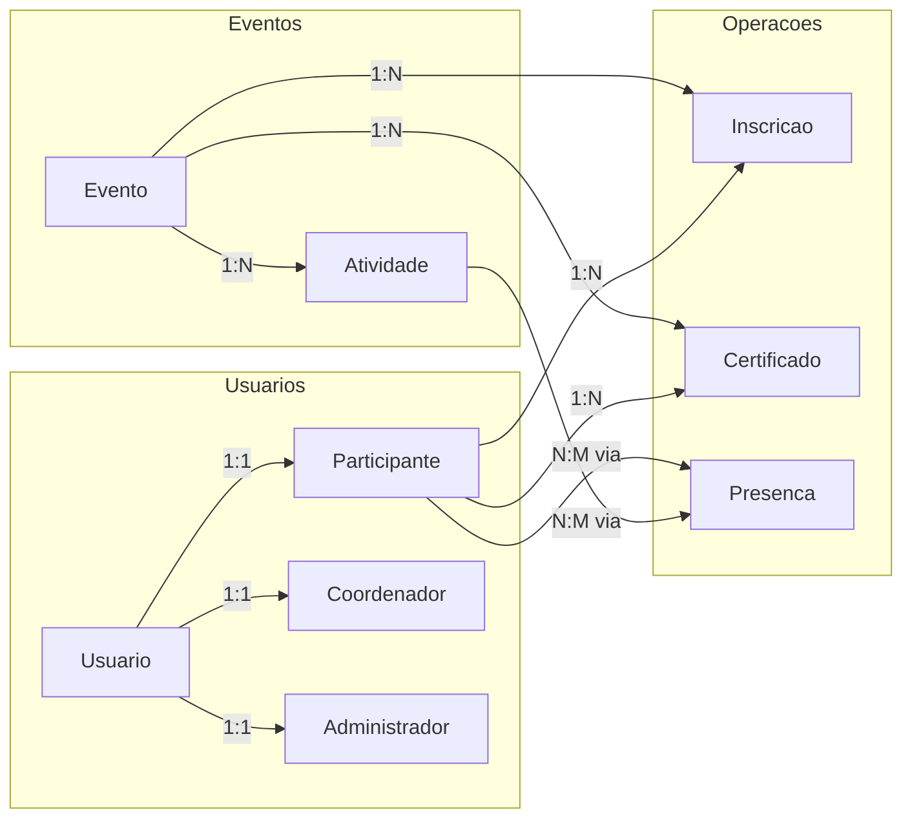

# Relatório do Banco de Dados - Sistema de Gestão de Eventos Acadêmicos (SGEA)

## 1. Visão Geral

O banco de dados **sistema_eventos** é projetado para gerenciar eventos acadêmicos, incluindo controle de usuários (participantes, coordenadores e administradores), eventos, atividades, inscrições, presenças e certificados.

**SGBD:** PostgreSQL  
**Encoding:** UTF8

---

## 2. Diagrama Entidade-Relacionamento (ER)



---

## 3. Diagrama de Fluxo de Dados



---

## 4. Descrição das Tabelas

### 4.1 Usuario (Tabela Pai)
Tabela base para o sistema de herança de usuários.

| Coluna | Tipo | Restrição | Descrição |
|--------|------|-----------|-----------|
| id | SERIAL | PK | Identificador único (auto-incremento) |
| nome | VARCHAR(255) | NOT NULL | Nome completo do usuário |
| email | VARCHAR(255) | UNIQUE, NOT NULL | Email (identificador único) |
| senha | VARCHAR(255) | NOT NULL | Senha criptografada |
| tipo | VARCHAR(50) | - | Tipo do usuário (participante, coordenador, admin) |

### 4.2 Participante
Herda de Usuario via chave estrangeira.

| Coluna | Tipo | Restrição | Descrição |
|--------|------|-----------|-----------|
| usuario_id | INT | PK, FK | Referência ao Usuario (id) |
| categoria | VARCHAR(255) | - | Categoria do participante (ex: aluno, professor) |

### 4.3 Coordenador
Herda de Usuario via chave estrangeira.

| Coluna | Tipo | Restrição | Descrição |
|--------|------|-----------|-----------|
| usuario_id | INT | PK, FK | Referência ao Usuario (id) |

### 4.4 Administrador
Herda de Usuario via chave estrangeira.

| Coluna | Tipo | Restrição | Descrição |
|--------|------|-----------|-----------|
| usuario_id | INT | PK, FK | Referência ao Usuario (id) |

### 4.5 Evento
Tabela principal de eventos acadêmicos.

| Coluna | Tipo | Restrição | Descrição |
|--------|------|-----------|-----------|
| id | SERIAL | PK | Identificador único |
| nome | VARCHAR(255) | NOT NULL | Nome do evento |
| instituicao | VARCHAR(255) | - | Instituição organizadora |
| modalidade | VARCHAR(255) | - | Modalidade (presencial, online, híbrido) |
| dataInicio | DATE | - | Data de início |
| dataFim | DATE | - | Data de término |
| status | VARCHAR(50) | - | Status (planejado, em_andamento, concluído) |

### 4.6 Atividade
Atividades vinculadas a um evento.

| Coluna | Tipo | Restrição | Descrição |
|--------|------|-----------|-----------|
| id | SERIAL | PK | Identificador único |
| titulo | VARCHAR(255) | NOT NULL | Título da atividade |
| cargaHoraria | INT | - | Carga horária (horas) |
| vagas | INT | - | Número de vagas disponíveis |
| local | VARCHAR(255) | - | Local da atividade |
| evento_id | INT | FK, NOT NULL | Referência ao Evento (id) |

### 4.7 Inscricao
Registro de inscrições de participantes em eventos.

| Coluna | Tipo | Restrição | Descrição |
|--------|------|-----------|-----------|
| id | SERIAL | PK | Identificador único |
| status | VARCHAR(50) | - | Status (pendente, confirmada, cancelada) |
| data | DATE | DEFAULT CURRENT_DATE | Data da inscrição |
| participante_id | INT | FK, NOT NULL | Referência ao Participante (usuario_id) |
| evento_id | INT | FK, NOT NULL | Referência ao Evento (id) |

### 4.8 Certificado
Certificados emitidos para participantes.

| Coluna | Tipo | Restrição | Descrição |
|--------|------|-----------|-----------|
| codigo | VARCHAR(255) | PK | Código único de validação |
| cargaHoraria | INT | - | Carga horária certificada |
| status | VARCHAR(50) | - | Status (emitido, validado, revogado) |
| participante_id | INT | FK, NOT NULL | Referência ao Participante (usuario_id) |
| evento_id | INT | FK, NOT NULL | Referência ao Evento (id) |

### 4.9 Presenca
Controle de presença em atividades (chave composta).

| Coluna | Tipo | Restrição | Descrição |
|--------|------|-----------|-----------|
| checkIn | TIMESTAMP | - | Horário de entrada |
| checkOut | TIMESTAMP | - | Horário de saída |
| participante_id | INT | PK, FK, NOT NULL | Referência ao Participante (usuario_id) |
| atividade_id | INT | PK, FK, NOT NULL | Referência à Atividade (id) |

---

## 5. Relacionamentos



### Resumo dos Relacionamentos

| Tabela Origem | Tabela Destino | Cardinalidade | Tipo |
|---------------|----------------|---------------|------|
| Usuario | Participante | 1:1 | Herança |
| Usuario | Coordenador | 1:1 | Herança |
| Usuario | Administrador | 1:1 | Herança |
| Evento | Atividade | 1:N | Composição |
| Evento | Inscricao | 1:N | Associação |
| Evento | Certificado | 1:N | Associação |
| Participante | Inscricao | 1:N | Associação |
| Participante | Certificado | 1:N | Associação |
| Participante + Atividade | Presenca | N:M | Associação (tabela associativa) |

---

## 6. Script SQL Completo

```sql
CREATE DATABASE sistema_eventos WITH ENCODING = 'UTF8';

-- Remover tabelas se existirem (ordem correta para evitar erros de dependência)
DROP TABLE IF EXISTS Presenca;
DROP TABLE IF EXISTS Certificado;
DROP TABLE IF EXISTS Inscricao;
DROP TABLE IF EXISTS Atividade;
DROP TABLE IF EXISTS Evento;
DROP TABLE IF EXISTS Administrador;
DROP TABLE IF EXISTS Coordenador;
DROP TABLE IF EXISTS Participante;
DROP TABLE IF EXISTS Usuario;

-- Tabela Pai: Usuario
CREATE TABLE Usuario (
    id SERIAL PRIMARY KEY,
    nome VARCHAR(255) NOT NULL,
    email VARCHAR(255) UNIQUE NOT NULL,
    senha VARCHAR(255) NOT NULL,
    tipo VARCHAR(50)
);

-- Herança: Participante
CREATE TABLE Participante (
    usuario_id INT PRIMARY KEY,
    categoria VARCHAR(255),
    CONSTRAINT fk_participante_usuario FOREIGN KEY (usuario_id) 
        REFERENCES Usuario(id) ON DELETE CASCADE
);

-- Herança: Coordenador
CREATE TABLE Coordenador (
    usuario_id INT PRIMARY KEY,
    CONSTRAINT fk_coordenador_usuario FOREIGN KEY (usuario_id) 
        REFERENCES Usuario(id) ON DELETE CASCADE
);

-- Herança: Administrador
CREATE TABLE Administrador (
    usuario_id INT PRIMARY KEY,
    CONSTRAINT fk_administrador_usuario FOREIGN KEY (usuario_id) 
        REFERENCES Usuario(id) ON DELETE CASCADE
);

-- Tabela: Evento
CREATE TABLE Evento (
    id SERIAL PRIMARY KEY,
    nome VARCHAR(255) NOT NULL,
    instituicao VARCHAR(255),
    modalidade VARCHAR(255),
    dataInicio DATE,
    dataFim DATE,
    status VARCHAR(50)
);

-- Tabela: Atividade
CREATE TABLE Atividade (
    id SERIAL PRIMARY KEY,
    titulo VARCHAR(255) NOT NULL,
    cargaHoraria INT,
    vagas INT,
    local VARCHAR(255),
    evento_id INT NOT NULL,
    CONSTRAINT fk_atividade_evento FOREIGN KEY (evento_id) 
        REFERENCES Evento(id) ON DELETE CASCADE
);

-- Tabela: Inscricao
CREATE TABLE Inscricao (
    id SERIAL PRIMARY KEY,
    status VARCHAR(50),
    data DATE DEFAULT CURRENT_DATE,
    participante_id INT NOT NULL,
    evento_id INT NOT NULL,
    CONSTRAINT fk_inscricao_participante FOREIGN KEY (participante_id) 
        REFERENCES Participante(usuario_id),
    CONSTRAINT fk_inscricao_evento FOREIGN KEY (evento_id) 
        REFERENCES Evento(id)
);

-- Tabela: Certificado
CREATE TABLE Certificado (
    codigo VARCHAR(255) PRIMARY KEY,
    cargaHoraria INT,
    status VARCHAR(50),
    participante_id INT NOT NULL,
    evento_id INT NOT NULL,
    CONSTRAINT fk_certificado_participante FOREIGN KEY (participante_id) 
        REFERENCES Participante(usuario_id),
    CONSTRAINT fk_certificado_evento FOREIGN KEY (evento_id) 
        REFERENCES Evento(id)
);

-- Tabela: Presenca
CREATE TABLE Presenca (
    checkIn TIMESTAMP,
    checkOut TIMESTAMP,
    participante_id INT NOT NULL,
    atividade_id INT NOT NULL,
    PRIMARY KEY (participante_id, atividade_id),
    CONSTRAINT fk_presenca_participante FOREIGN KEY (participante_id) 
        REFERENCES Participante(usuario_id),
    CONSTRAINT fk_presenca_atividade FOREIGN KEY (atividade_id) 
        REFERENCES Atividade(id)
);
```

---

## 7. Regras de Negócio e Restrições

### 7.1 Integridade Referencial
- **ON DELETE CASCADE** em:
  - Participante, Coordenador, Administrador (se usuário for deletado, o registro específico também é)
  - Atividade (se evento for deletado, atividades também são)
  
- **Restrição padrão** em:
  - Inscricao, Certificado, Presenca (proteção contra deleção de registros referenciados)

### 7.2 Validações
- Email deve ser único na tabela Usuario
- Código do certificado deve ser único (chave primária)
- Presença usa chave composta (participante_id + atividade_id) para evitar duplicidade

### 7.3 Valores Padrão
- Data de inscrição: data atual do sistema (CURRENT_DATE)
- IDs: auto-incremento via SERIAL

---

## 8. Índices Recomendados

```sql
-- Para melhorar performance de consultas frequentes
CREATE INDEX idx_usuario_email ON Usuario(email);
CREATE INDEX idx_inscricao_participante ON Inscricao(participante_id);
CREATE INDEX idx_inscricao_evento ON Inscricao(evento_id);
CREATE INDEX idx_presenca_atividade ON Presenca(atividade_id);
CREATE INDEX idx_certificado_codigo ON Certificado(codigo);
CREATE INDEX idx_atividade_evento ON Atividade(evento_id);
```

---

## 9. Consultas Úteis (Queries)

### 9.1 Listar todos os participantes com seus dados
```sql
SELECT u.id, u.nome, u.email, p.categoria
FROM Usuario u
JOIN Participante p ON u.id = p.usuario_id;
```

### 9.2 Eventos com suas atividades
```sql
SELECT e.nome AS evento, a.titulo AS atividade, a.cargaHoraria, a.local
FROM Evento e
LEFT JOIN Atividade a ON e.id = a.evento_id
ORDER BY e.dataInicio, a.titulo;
```

### 9.3 Participantes inscritos em um evento
```sql
SELECT u.nome, u.email, i.status, i.data
FROM Inscricao i
JOIN Participante p ON i.participante_id = p.usuario_id
JOIN Usuario u ON p.usuario_id = u.id
WHERE i.evento_id = ?;
```

### 9.4 Presença em atividades
```sql
SELECT u.nome, a.titulo, pr.checkIn, pr.checkOut
FROM Presenca pr
JOIN Participante p ON pr.participante_id = p.usuario_id
JOIN Usuario u ON p.usuario_id = u.id
JOIN Atividade a ON pr.atividade_id = a.id
ORDER BY a.titulo, pr.checkIn;
```

### 9.5 Certificados emitidos
```sql
SELECT c.codigo, u.nome AS participante, e.nome AS evento, 
       c.cargaHoraria, c.status
FROM Certificado c
JOIN Participante p ON c.participante_id = p.usuario_id
JOIN Usuario u ON p.usuario_id = u.id
JOIN Evento e ON c.evento_id = e.id;
```

---

## 10. Considerações do Modelo

### Pontos Fortes
1. **Herança via Chave Estrangeira**: Implementa corretamente o padrão de herança no PostgreSQL
2. **Integridade Referencial**: Uso adequado de chaves estrangeiras
3. **Cascade Delete**: Tratamento apropriado para entidades dependentes
4. **Chave Composta**: Presença usa (participante_id, atividade_id) evitando duplicidade

### Possíveis Melhorias
1. Adicionar **CHECK constraints** para validar valores (ex: status, modalidade)
2. Implementar **índices** para melhorar performance em consultas frequentes
3. Adicionar campos de **auditoria** (created_at, updated_at) se necessário
4. Considerar uso de **ENUM** para campos com valores fixos (status, tipo, modalidade)
5. Adicionar **unique constraint** em Inscricao (participante_id, evento_id) para evitar inscrições duplicadas

---

## 11. Diagrama de Classes (Representação Orientada a Objetos)

```
┌─────────────────────────┐
│        Usuario          │
├─────────────────────────┤
│ - id: int               │
│ - nome: string          │
│ - email: string         │
│ - senha: string         │
│ - tipo: string          │
└───────────┬─────────────┘
            │
    ┌───────┴───────┬───────────┐
    ▼               ▼           ▼
┌─────────┐   ┌──────────┐  ┌────────────┐
│Participante│ │Coordenador│ │Administrador│
├─────────┤   ├──────────┤  ├────────────┤
│-categoria│ │          │  │            │
└────┬────┘   └──────────┘  └────────────┘
     │
     │
┌────┴────────────────────────────────────┐
│            Sistema de Eventos           │
├────────────────────────────────────────┤
│ Evento ────> Atividade                 │
│ Participante ──> Inscricao ──> Evento  │
│ Participante ──> Presenca ──> Atividade│
│ Participante ──> Certificado <── Evento │
└────────────────────────────────────────┘
```

---

## 12. Glossário

| Termo | Definição |
|-------|-----------|
| SERIAL | Tipo de dado PostgreSQL para auto-incremento |
| PK | Primary Key (Chave Primária) |
| FK | Foreign Key (Chave Estrangeira) |
| UK | Unique Key (Chave Única) |
| CASCADE | Ação referencial que propaga deleção para tabelas dependentes |
| TIMESTAMP | Tipo de dado para data e hora |
| CHECK | Restrição para validar valores em colunas |

---

**Documento gerado em:** 2026-05-06  
**Versão do Banco:** 1.0  
**Autor:** Sistema SGEA
